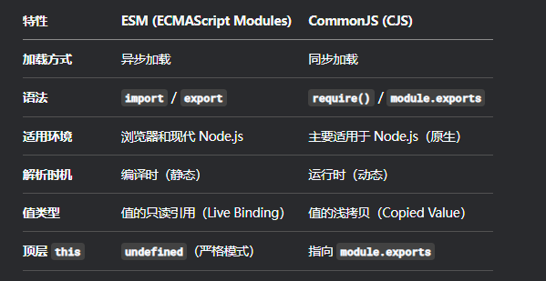

 

## 数据类型

### 分类

- 基本数据类型: `string`、`boolean`、`number`、`null`、`undefined`、`bigInt`、`symbol`

  这些类型的值直接存储在栈内存（Stack）中，因为它们占用空间小、大小固定。

- 引用数据类型：不是基本数据类型的其他数据都属于引用数据类型的范畴，常用的有：`Object`、`Array`、`Function`等

  这些类型的值存储在堆内存（Heap）中，而栈内存中存储的是该值的引用（即内存地址）。因为引用数据类型可能占用空间大且大小不固定。

### 隐式类型转换

转换的目标类型可能有三种：转`boolean`、转数字、转字符串。

#### 转`boolean`

转`boolean`的隐式转换过程一般发生在条件表达式中。

在条件判断时， 除了`undefined`、`null`、`false`、`NaN`、空字符串、
`0` 、`-0` ，其他所有值都转为`true`， 包括所有对象。

#### 转数字

四则运算中的转数字：

- 字符串和数字除加法外的四则运算：字符串会优先转为数字，如果字符串不是一个合法的数字格式则转为`NaN`

- `boolean`和数字的四则运算：`true`转为`1`, `false`转为`0`

- `null`隐式转换为数字`0`，`undefined`隐式转换为`NaN`

比较表达式中的转数字：

- 字符串之间的比较：转为字符串对应`unicode`字符索引再进行比较

#### 转字符串

算数表达式中的加法运算，如果第一个操作数为字符串，则其他操作数都会被转为字符串。

`NaN`会转为`'NaN'`，`undefined`会转为`'undefined'`，`null`会转为`'null'`，对象类型会优先调用`toString`方法转换，否则转为`[object object]`

#### 对象转原始类型

一般在算数表达式中可能会出现这类场景。对象会调用内置的一些取值方法，顺序：`Symbol.toPrimitive`、`obj.valueOf()`、`obj.toString()`。如果这三个方法的返回都不为基本数据类型则报错。


### typeof和instanceof

`typeof`关键字用于基本数据类型的判别，对于typeof关键字而言，有一些值得注意的特殊情况：

- typeof null === 'object'

- typeof undefined === 'undefined'

- 对于引用数据类型而言，Function是可以被typeof识别出来的

`instanceof`用于判断某个引用数据类型的实例对象对应构造函数的`prototype`属性是否出现在某个实例对象的原型链上，如：

```js
object instanceof constructor
```

### 引用数据类型

#### this指向问题

- 非箭头函数场景：

  - 一般情形：遵循“谁调用，指向谁”
  - 通过`bind`指定`this`: `this`指向由第⼀次`bind`决定（使用`bind`绑定`this`后就不可改变了，包括通过`call`和`apply`调用）
  - `call`、`apply`可以指定函数在单次调用的`this`指向

- 箭头函数场景：箭头函数中的`this`只取决包裹箭头函数的第⼀个普通函数的`this`

#### == 和 ===

对于引用数据类型而言，使用`==`进行比较实际上会对引用数据类型进行隐式类型转换后再进行比较，而使用`===`则只是对对象引用进行比较，如果`===`两端的对象指向同一个引用，则返回`true`，否则结果为`false`。

#### 深拷贝/浅拷贝

引用数据类型的变量不能像基础数据类型一样通过直接赋值进行拷贝，这样会导致两个变量的引用相同，指向同一块区域，会导致对该区域的修改变化同时应用于两个变量中。

浅拷贝返回的结果是一个全新的对象，新对象内部属性只对源对象第一层级的属性进行拷贝（属性值为引用数据类型也只复制引用），常用的浅拷贝的方式有如下两种：

- 拓展运算符 `...`
- `Object.assign`

深拷贝返回的结果则是复制一个全新的对象， 新对象内部属性值符合如下特点：

- 属性值为基本数据类型：值与源对象一致
- 属性值为引用数据类型：值为源对象对应属性值的深拷贝结果

#### 原型与原型链

##### 概念

`JavaScript`的原型链是其实现继承和属性查找的核心特性。每个对象都有一个内部属性`[[Prototype]]`（可通过`__proto__`访问），指向它的原型对象。当访问对象的属性时，如果对象自身没有该属性，`JavaScript`会沿着原型链向上查找，直到找到该属性或到达链的末端（`null`）。

每个函数都有一个`prototype`属性，当使用new操作符创建实例时，实例的`[[Prototype]]`会指向该函数的prototype对象。这样，所有实例都可以共享原型对象上的属性和方法。

原型链的顶端是`Object.prototype`，它的`[[Prototype]]`为`null`。

##### javascript的类继承

###### 原型链继承

子类通过原型链寻找属性的方式访问父类实例对象上的属性，通过这种方式实现父类属性的继承：

```js
function Father() {
    this.name = 'xiaoming'
    this.info = {}
}
function Child() {
}
Child.prototype = new Parent();
```

这种方法的缺点是，每个`Child`对象的实例的`__proto__`都是共用的。

###### 构造函数继承

子类构造函数内部调用父类构造函数对属性进行初始化，通过这种方式实现父类属性的继承：

```js
function Father(){
    this.name = 'xiaoming';
}

function Child(){
    Father.call(this);
}

let child = new Child();

```

这种方式虽然实现了父类属性的继承，但是没办法实现父类方法的继承。

###### 组合继承

原型链继承 + 构造函数继承，实现父类属性 + 父类方法的继承：

```js
function Father(){
    this.name = 'xiaoming';
}

Father.prototype.getName = function () {
    return this.name;
}

function Child(){
    Father.call(this);
}

Child.prototype = new Father();

Child.prototype.constructor = Child;

let child = new Child();

child.getName()     // xiaoming

```

###### 寄生组合式继承

与组合式继承不同的点是，子类的`prototype`不再是父类的实例对象，而是父类`prototype`的浅拷贝：

```js
function Father(){
    this.name = 'xiaoming';
}

Father.prototype.getName = function () {
    return this.name;
}

function Child(){
    Father.call(this);
}

Child.prototype = Object.create(Father.prototype);

Child.prototype.constructor = Child;

let child = new Child();

child.getName()     // xiaoming
```

###### ES6：Class

实际开发中使用`ES6`的`Class`进行类定义，使用`extends`进行继承：

```js
class Father {
  constructor(name) {
    this.name = "xiaoming";
  }

  getName() {
    console.log(this.name);
  }
}


class Child extends Father {}
```

#### 常用对象类型用法汇总


##### Set和Map

`Set`用于存储唯一值，`Map`用于键值对。

由于`Set`内部值唯一的特性，可以用来做数组去重，如：

```js

const noDupArr = [...new Set(dupArr)]
```

相较于`Object`，使用`Map`存储键值对会有如下好处：

- 键的类型：`Map`的键可以是任何类型的值（函数、对象、基本类型都可以）。而`Object`的键只能是`String`或`Symbol`。

- 顺序：`Map`会严格按照键值对的插入顺序进行迭代

- 大小：可以直接通过`size`属性获取元素个数，而 Object 需要 Object.keys(obj).length。

- 性能：在频繁增删键值对的场景下，`Map`的性能通常更好

##### WeakSet和WeakMap

`WeakSet`和`WeakMap`是两个用于存放**弱引用**的数据结构。

`WeakSet`只能用于存放弱引用（`WeakSet`持有的对象引用不影响源对象的垃圾回收），假设弱引用对应的实际对象被垃圾回收，弱引用会自动从`WeakSet`中消失。

基于这种好处，可以有如下使用场景：

- 对某类对象进行标记：如`DOM`对象，可以通过`has`来判断是否存在对象引用来判断该对象的状态。由于`WeakSet`持有的是弱引用，使用`WeakSet`也不会造成内存泄露的问题

`WeakMap`存储键值对，键为某个对象的弱引用，当弱引用对应的原始对象被销毁，该键值对会被`WeakMap`移除。

##### Proxy和Reflect

这两个对象类型相互配合，用于实现对对象访问的拦截操作。

`Proxy`对象通过创建对象代理的方式，实现外部对对象的访问行为进行拦截，如：

```js

const target = { message: "hello" }; // 原始对象（目标对象）

const handler = {
  get: function(obj, prop) {
    return prop in obj ? obj[prop] : `Property ${prop} doesn't exist`;
  }
}; // 处理器对象（定义拦截行为）

const proxy = new Proxy(target, handler); // 创建代理对象

console.log(proxy.message); // "hello" （访问存在的属性）
console.log(proxy.unknown); // "Property unknown doesn't exist" （访问不存在的属性）
```

相较于`Object.defineProperty`，`Proxy`除了能拦截`get/set`，还能拦截`has`、`deleteProperty`、`apply`（函数调用）、`construct`（new操作符）、`ownKeys`等操作，且能拦截对数组任意的修改。

而`Reflect`则是一个工具类，提供一系列的工具方法协助我们在`Proxy`拦截的`handler`进行对象的操作。

### 场景问题

#### 浮点数运算精度损失问题（0.1 + 0.2 ≠ 0.3）

`JavaScript`中的精度损失主要源于其遵循`IEEE 754`标准的64位双精度浮点数格式，无法精确表示所有十进制小数（如`0.1`在二进制中是无限循环小数），导致计算时出现如`0.1 + 0.2 ≠ 0.3`的误差；为规避此问题，可采用以下方法：对小数运算结果进行四舍五入（如使用`Number.toFixed()`或手动乘以倍数后取整再除回），将小数转换为整数计算后再还原（例如货币计算以分为单位处理），或使用专门处理高精度的库（如`decimal.js`、`big.js`）以避免浮点数陷阱，同时在比较数字时使用容差范围（如`Math.abs(a - b) < 1e-10`）而非直接相等判断。

注意：`Number.toFixed`不遵循银行家舍入法（四舍六入五成双），而是遵循四舍五入。如果业务场景需要使用银行家舍入法，可使用`decimal.js`库规避，如：

```js
// 有问题的原生方式
console.log((1.255).toFixed(2)); // "1.26" (符合规范，但可能不符合直觉)
console.log((1.245).toFixed(2)); // "1.25" (因浮点误差导致，不符合“四舍五入”直觉)

// 精确的库方式
const Decimal = require('decimal.js');
let num = new Decimal(1.245);
console.log(num.toFixed(2)); // "1.25" (如果希望这是1.24，则需要库支持配置舍入模式)
// decimal.js 允许你配置舍入模式，默认是 ROUND_HALF_UP（四舍五入），也可以设置为 ROUND_HALF_EVEN（银行家算法）
let numBanker = new Decimal(1.255);
console.log(numBanker.toFixed(2, Decimal.ROUND_HALF_EVEN)); // 使用银行家舍入法，结果可能是 "1.26" 或 "1.24" 取决于前一位奇偶
```

## 执行上下文

### 基本概念

执行上下文是`JavaScript`中一个抽象的概念，它代表了`JavaScript`代码执行时的环境。

执行上下文包括三个部分：变量对象、作用域链、`this`指向。其中，变量对象是当前环境中声明的变量、函数和形参的属性，作用域链是当前环境与外部环境的链接，`this`指向是当前环境的`this`值。

执行栈是`JavaScript`中的一个数据结构，它用来存储执行上下文。当`JavaScript`代码执行时，执行栈会不断地将当前执行上下文压入栈中，并在执行完毕后将其弹出。`JavaScript`代码的执行顺序遵循“后进先出”的原则，也就是说，当前执行的上下文在执行完毕后，才会继续执行上一个上下文。

### 三种执行上下文类型

执行上下文的类型分为三种：

- 全局执行上下文：只有一个，浏览器中的全局对象就是`window`对象，`this`指向这个全局对象
- 函数执行上下文：存在无数个，只有在函数被调用的时候才会被创建，每次调用函数都会创建一个新的执行上下文
- `Eval`函数执行上下文： 指的是运行在`eval`函数中的代码，很少用而且不建议使用

### 生命周期

执行上下文的生命周期包括三个阶段：创建阶段 → 执行阶段 → 销毁阶段。


## 作用域

`JavaScript`遵循词法作用域。所谓词法作用域，即变量的作用域是在代码中定义时就已经确定了，而不是在运行时动态确定的。

### 三种作用域

JavaScript的作用域分以下三种：

- 全局作用域：运行所有代码的默认作用域
- 函数作用域：函数体内的作用域
- 块级作用域：使用let和const声明的变量仅在当前代码块内可被访问

### 作用域链机制

当在`Javascript`中使用一个变量的时候，首先`Javascript`引擎会尝试在当前作用域下去寻找该变量，如果没找到，再到它的上层作用域寻找，以此类推直到找到该变量或是已经到了全局作用域。这就是作用域链机制。

### var、let和const

在`ES6`之前，使用`var`进行变量声明。会有如下现象：

- 变量提升：如果定义晚于使用，会先执行定义。

- 允许重复声明，后面的声明会覆盖之前的。

- 在函数中使用`var`声明变量时候，该变量是局部的（外界访问不到）；不使用`var`声明直接使用，则会通过作用域链去找这个变量。

`ES6`的`let/const`对于这种过于自由的变量声明方式进行了约束。使用`let/const`声明的变量有如下特点：

- 不存在变量提升，只允许先声明后使用，不然报错

- 声明后，即创建块级作用域，存在暂时性死区的现象，如：
  
  ```js
    var a ='xiaoming'
    if (a === 'xiaoming') {
        a = 'xiaohong' // 报错
        let a;
    }
  ```

  上面代码虽然花括号外层存在a，但是由于后面使用let声明了a，这个区域就不让先声明后使用了。

- 不允许在相同作用域中重复声明变量

`let`声明的变量可以被重新赋值，而`const`声明的是常量，不可变。

`const`声明的常量不可变，针对的是其字面量，如果直接对其进行修改（如重新赋值）是不允许的。不过对于引用数据类型，修改引用数据对象的内部属性则不受限制。

## 内存管理

### 基本机制

`JavaScript`的垃圾回收机制用于检测和清除不再使用的对象，以释放内存空间。这种机制的优点就是无需手动释放内存，可以帮助开发人员避免内存泄漏和其他相关问题。

常见垃圾回收算法有如下两种：

1. 引用计数(已不再被使用)：垃圾回收器还会跟踪每个变量和对象被引用的次数。如果一个对象没有任何引用，那么垃圾回收器会立即清除它。但是，这种方法容易造成循环引用的问题，导致内存泄漏。
2. 标记清除：垃圾回收器会定期检查内存中的所有变量和对象，标记那些不再被引用的变量和对象，然后将其清除。

### V8引擎的垃圾回收机制

#### 分代回收

`V8`将堆内存分为新生代（`Young Generation`）和老生代（`Old Generation`），针对不同生命周期对象采用差异化回收策略。

#### 新生代：Scavenge算法

新生代内存区占堆内存的 1~8MB（32位系统为 16MB，64位为 32MB），对象存活时间短（如局部变量），使用`Scavenge`算法进行`GC`。

下面是`Scavenge`算法的工作流程：

1. 将内存划分为两等份：`From`（对象区）和 `To`（空闲区）

2. 当`From`区满时，标记存活对象并复制到`To`区，同时完成内存整理（无碎片）

3. 复制后交换`From/To`角色，原`To`区变为新`From`区

4. 对象晋升：存活超过两次`GC`的对象，或`To`区占用超`25%`时，晋升至老生代

#### 老生代：标记-清除 + 标记-整理

相较于新生代内存区，老生代内存区容量更大（64位系统约 1.4GB），使用标记-清除和标记-整理算法进行`GC`。

- 标记-清除（`Mark-Sweep`）：遍历根节点（全局对象、栈变量等），标记活动对象，清除未标记对象（产生内存碎片）

- 标记-整理（`Mark-Compact`）：在标记后移动存活对象至内存一端，清除边界外碎片（解决内存不连续问题）

#### 过程优化：增量标记

增量标记将原本需要一次性长时间暂停主线程的标记阶段拆分成多个极短的小任务，从而极大地减少每次停顿对应用程序流畅性的影响。工作过程如下：

1. 触发与开始：当老生代内存使用量达到一定阈值时，`V8`不会立即进行一次完整的、会造成长时间停顿的垃圾回收，而是启动一个增量标记周期。

2. 初始标记： 垃圾回收器仅从根对象（如全局对象、当前执行栈）出发，标记第一层直接可达的对象。这个阶段非常快，产生的停顿时间极短，几乎无感。

3. 增量标记：初始标记完成后，主线程恢复执行`JavaScript`应用程序。剩余的标记任务被分解成很多个小片段。每当主线程执行完一个微小任务或出现空闲时间（如事件循环的空闲期），垃圾回收器就插入执行一小段标记任务，标记下一批可达对象。这个过程是“增量”的：主线程执行一会 JavaScript -> 执行一小段 GC 标记 -> 再执行 JavaScript -> 再执行一小段标记 ... 如此循环，直到整个对象图被标记完。

4. 写屏障:在增量标记期间，JavaScript 也在运行，它会不停地修改对象之间的引用关系，这可能会使已经标记过的对象图失效。写屏障（Write Barrier） 就是为了解决这个问题而存在的技术。它是一个监视所有对象写操作的机制。具体规则是：如果一个黑色对象（已标记完成） 突然被修改，去引用了一个白色对象（尚未标记），那么写屏障会强制将那个白色对象标记为灰色（待处理），从而防止它被错误地当作垃圾清理掉。
   > 三色标记法（Tri-color Marking）：
   > - 白色：尚未被垃圾回收器访问到的对象（初始状态，默认颜色）。
   >
   > - 灰色：已被垃圾回收器发现，但其引用的其他对象还未被检查。
   >
   > - 黑色：对象已被垃圾回收器访问过，且该对象所有引用的对象也都已被检查过了。
   >
   > 写屏障的作用就是：不允许黑色对象直接引用白色对象。一旦发生，要么将黑色对象变回灰色，要么直接将白色对象标记为灰色。

5. 最终标记: 当所有增量标记片段都执行完毕，几乎所有可达对象都已标记时，主线程会再次被短暂地停顿。垃圾回收器会处理一遍在增量标记期间由写屏障所记录下来的所有额外引用变更，确保没有任何对象被遗漏。这个步骤确保了标记结果的绝对准确性。

6. 完成与清理:标记阶段正式结束。此后，垃圾回收器会启动并发或并行的清理任务，去释放那些未被标记的内存空间。这个清理过程通常不需要主线程过多参与。

### 内存泄露场景及对策

常见场景：

1. 意外的全局变量：未声明的变量或挂载到 `window` 的函数。

2. 遗忘的定时器或回调：未清除的`setInterval`、`setTimeout`及事件监听器（`Event Listeners`）。

3. 脱离引用的`DOM`元素：已从`DOM`树移除，但仍在`JavaScript`中被变量引用。

4. 闭包导致的内存泄露：函数持有外部作用域变量的引用，且未被适时释放。

对策：

1. 避免全局变量：使用严格模式`'use strict'`；必要时手动置`null`。

2. 定时器/监听器不用的时候及时清理。

3. 解除`DOM`引用：移除`DOM`元素后，将其对应的`JavaScript`变量置`null`。

4. 谨慎使用闭包：确保闭包内引用的外部变量在不再需要时可被回收。

## 异步编程

### 事件循环机制

`JavaScript`是单线程的，当前任务执行完才能执行下一任务，如果当前任务执行时间过长会造成阻塞，为了解决该问题，`js`的运行时采用事件循环机制来解决这一问题。

执行同步代码时，会调用一些由运行环境（如浏览器、Node.js）提供的异步`Web API`（如 `setTimeout`, `fetch`, `addEventListener`）。这些`API`会立即返回，但它们所请求的操作（如计时、网络请求）会由浏览器或其他线程在后台并行处理。JavaScript引擎本身不处理这些耗时操作，从而避免了阻塞。当这些后台操作完成后，会将其回调函数作为一个异步任务放入相应的任务队列中，等待事件循环来处理。

异步任务包括宏任务和微任务：

- 常见微任务：`Promise.then`，`Object.observe`，`MutationObserver`，`process.nextTick`(Node 环境)。

- 常见宏任务：`setTimeout`，`ajax`，`dom`事件，`setImmediate`(Node 环境)，`requestAnimationFrame`。

对异步任务的处理流程如下：

- 同步代码执行完毕后会开始从调用栈中去执行异步任务

- 优先执行微任务队列，当微任务队列清空后才会去执行宏任务

- 每次单个宏任务执行完毕后会去检查微任务队列是否为空，如果不为空会按照先入先出的原则执行微任务（微任务中也可以产生异步任务），待微任务队列清空后再执行下一个宏任务，如此循环往复。

### 异步编程解决方案

四种异步编程的解决方案：回调函数、`Promise`、`Generator`、`async/await`。

传统的JavaScript使用回调进行异步编程，即：在完成某个操作后，就会执行回调函数内地内容。不过，如果回调的层数一多，就会很麻烦，比如：

```js
getData(function(a) {
    getMoreData(a, function(b) {
        getEvenMoreData(b, function(c) {
            console.log('Final result: ' + c);
        }, failureCallback);
    }, failureCallback);
}, failureCallback);
```
这还是比较少的情况，嵌套一多直接头皮发麻，即所谓回调地狱。

Promise的出现解决了回调地狱的问题，链式调用增强了代码可读性，上面的代码可变为：

```js
getData() // 返回一个Promise
  .then(a => getMoreData(a)) // 返回一个新的Promise
  .then(b => getEvenMoreData(b)) // 返回一个新的Promise
  .then(c => {
    console.log('Final result: ' + c);
  })
  .catch(failureCallback); // 统一错误处理
```

在`async/await`标准化之前，一般使用`Generator`函数来模拟“同步风格”的异步编程。可以参考下面的示例代码：

```js
// 1. 定义一个模拟的异步函数，返回Promise
function asyncTask(value, delay = 100) {
  return new Promise(resolve => setTimeout(() => resolve(value), delay));
}

// 2. 编写主逻辑 Generator 函数
function* main() {
  try {
    console.log('Start...');
    const result1 = yield asyncTask(42); // Yield一个Promise
    console.log('Step 1:', result1); // 42

    const result2 = yield asyncTask(100, 500);
    console.log('Step 2:', result2); // 100

    const result3 = yield asyncTask('Done', 200);
    console.log('Step 3:', result3); // 'Done'

    return 'All tasks completed'; // 最终返回值
  } catch (err) {
    console.error('Generator caught an error:', err);
  }
}

function run(generatorFunc) {
  // 创建迭代器
  const iterator = generatorFunc();

  // 递归函数，处理下一个值
  function iterate(iteration) {
    // 如果Generator执行完毕，直接返回最终结果
    if (iteration.done) {
      return iteration.value;
    }
    
    // 假设yield出来的总是Promise
    const promise = iteration.value;
    
    // 等待Promise解决，然后继续迭代
    return promise.then(
      // Promise成功回调
      (resolvedValue) => iterate(iterator.next(resolvedValue)),
      // Promise失败回调
      (error) => iterate(iterator.throw(error))
    );
  }

  // 启动迭代
  return iterate(iterator.next());
}

// 3. 用运行器执行Generator
run(main).then(finalResult => {
  console.log('Final Result:', finalResult); // "All tasks completed"
});

// 输出顺序:
// "Start..."
// (等待约100ms)
// "Step 1: 42"
// (等待约500ms)
// "Step 2: 100"
// (等待约200ms)
// "Step 3: Done"
// "Final Result: All tasks completed"
```

`async/await`是生成器函数的语法糖，使用`async/await`时候无需再手动编写`Runner`函数。上面代码可重构为：

```js
// 模拟异步函数 (保持不变)
function asyncTask(value, delay = 100) {
  return new Promise(resolve => setTimeout(() => resolve(value), delay));
}

// Async 函数 (直接替换 Generator 函数)
async function main() {
  try {
    console.log('Start...');
    
    // 使用 await 替代 yield
    const result1 = await asyncTask(42);
    console.log('Step 1:', result1);

    const result2 = await asyncTask(100, 500);
    console.log('Step 2:', result2);

    const result3 = await asyncTask('Done', 200);
    console.log('Step 3:', result3);

    return 'All tasks completed';
  } catch (err) {
    console.error('Async function caught an error:', err);
  }
}

// 直接调用 Async 函数 (不再需要运行器)
main().then(finalResult => {
  console.log('Final Result:', finalResult);
});

```

## 模块化方案

### 立即执行函数 IIFE

使用立即执行函数（IIFE）创建私有作用域，通过闭包实现模块功能。如：

```js
var Module = (function() {
  var privateVar = 'I am private';
  function privateMethod() {
    console.log(privateVar);
  }
  return {
    publicMethod: function() {
      privateMethod();
    }
  };
})();

Module.publicMethod(); // 输出: I am private

```

### 过时的几种方案：AMD/CMD/UMD

#### AMD

`AMD`（`Asynchronous Module Definition`，异步模块定义）是一种在浏览器环境中使用的`JavaScript`模块化规范。它的核心目标是让模块及其依赖能够**异步并行加载**，从而提高页面的加载速度和性能。

`AMD`规范主要定义了两个核心函数：`define`用于定义模块，`require`用于加载模块。

`require.js`是基于`AMD`标准实现的，下面的代码展示了基本的用法（默认全局引入`require.js`）：

```js
 // 定义math模块
define('math', function() {
    return {
        add: function(a, b) {
            return a + b;
        },
        multiply: function(a, b) {
            return a * b;
        };
});

// 定义ui模块，依赖math模块
define('ui', ['math'], function(math) {
    return {
        displayResult: function(elementId, result) {
            document.getElementById(elementId).textContent = '计算结果: ' + result;
        }
    };
});

// 运行演示的函数
function runDemo() {
    require(['math', 'ui'], function(math, ui) {
        // 计算 10 + 20
        var sum = math.add(10, 20);
        ui.displayResult('result1', '10 + 20 = ' + sum);
                
        // 计算 5 * 6
        var product = math.multiply(5, 6);
        ui.displayResult('result2', '5 × 6 = ' + product);
    });
}
```
#### CMD

`CMD`（`Common Module Definition`）是一种模块定义规范，主要用于浏览器端的`JavaScript`模块化开发。它是`Sea.js`推广的模块定义格式，强调**依赖就近和延迟执行**。


下面是一个简单的使用示例（默认全局引入`sea.js`）：

```js
// 配置Sea.js
seajs.config({
    base: "./",
    alias: {
        "math": "math.js",
        "util": "util.js",
        "main": "main.js"
    }
});
        
// 定义math模块
define('math.js', function(require, exports, module) {
    var add = function(a, b) {
        return a + b;
    };
            
    var multiply = function(a, b) {
        return a * b;
    };
            
    exports.add = add;
    exports.multiply = multiply;
});
        
// 定义util模块
define('util.js', function(require, exports, module) {
    var math = require('./math');
    var square = function(x) {
        return math.multiply(x, x);
    };
            
    var cube = function(x) {
        return math.multiply(x, math.multiply(x, x));
    };
            
    exports.square = square;
    exports.cube = cube;
});
        
// 定义主模块
define('main.js', function(require, exports, module) {
    var math = require('./math');
    var util = require('./util');
            
    var calculate = function() {
        var a = 5, b = 3;
                
        return {
            addition: math.add(a, b),
            multiplication: math.multiply(a, b),
            square: util.square(a),
            cube: util.cube(b)
        };
    };
            
    exports.calculate = calculate;
});
        
// 使用模块
document.getElementById('calculateBtn').addEventListener('click', function() {
    seajs.use('main', function(main) {
        var results = main.calculate();
        document.getElementById('additionResult').textContent = results.addition;
        document.getElementById('multiplicationResult').textContent = results.multiplication;
        document.getElementById('squareResult').textContent = results.square;
        document.getElementById('cubeResult').textContent = results.cube;
    });
});

```

#### UMD

`UMD`（`Universal Module Definition`）是一种`JavaScript`模块化规范，旨在让**代码能在多种环境中工作**，包括浏览器、`Node.js`和`AMD`兼容的加载器。

`UMD`通过把`AMD`和`CommonJS`糅合，实现多环境通用，实现`UMD`的示例代码如下：

```js
// 模拟UMD模块
(function (root, factory) {
    if (typeof define === 'function' && define.amd) {
        // AMD支持
        define([], factory);
    } else if (typeof exports === 'object') {
        // CommonJS支持
        module.exports = factory();
    } else {
        // 浏览器全局变量
        root.Calculator = factory();
    }
}(this, function () {
    // 模块功能实现
    var Calculator = function() {};
            
    Calculator.prototype.add = function(a, b) {
        return a + b;
    };
            
    Calculator.prototype.multiply = function(a, b) {
        return a * b;
    };
            
    return Calculator;
}));

function runDemo() {
    // 使用全局变量中的Calculator
    var calc = new Calculator();
    var sum = calc.add(5, 3);
    var product = calc.multiply(5, 3);
    document.getElementById('result').innerHTML =  '5 + 3 = ' + sum + '<br>' +
        '5 × 3 = ' + product;
}
```

### Nodejs环境: CommonJS

`CommonJS`是`Node`环境下的模块化方案。

#### 用法

导出模块：

```js
// math.js
// 导出单个功能
exports.add = function(a, b) {
    return a + b;
};

// 或者导出整个对象
module.exports = {
    multiply: function(a, b) {
        return a * b;
    },
    PI: 3.14159
};
```

在其他模块使用：

```js
// app.js
const math = require('./math.js');

console.log(math.add(2, 3)); // 输出: 5
console.log(math.multiply(4, 5)); // 输出: 20
console.log(math.PI); // 输出: 3.14159
```

#### 特点

- 模块独立作用域: 每个模块有自己的作用域，不会污染全局空间

- 同步加载: 适合服务器端环境

- 模块缓存: 模块在第一次加载后会被缓存

### 浏览器环境/Nodejs环境: ESM

`ESM` 是`JavaScript`官方标准化的模块系统，旨在统一和规范化`JavaScript`在浏览器和服务器等不同环境中的模块定义和使用方式。它在`ES6`（`ECMAScript 2015`）中被正式引入。

`Node.js`在`v12.17.0`为所有`Node.js`应用程序提供了`ESM`支持（参考[Release 2020-05-26, Version 12.17.0 'Erbium' (LTS), @targos · nodejs/node](https://github.com/nodejs/node/releases/tag/v12.17.0)），因此该规范在`Node.js`也是适用的。

#### 用法

导出模块：

- 具名导出：

    ```js
    // math.js
    export const pi = 3.14159;
    export function add(a, b) {
    return a + b;
    }
    // 或者先在代码底部统一导出
    const pi = 3.14159;
    function add(a, b) { ... }
    export { pi, add }; // 推荐这种方式，清晰明了
    ```
- 默认导出:

    ```js
    // logger.js
    export default function log(message) {
    console.log(message);
    }
    ```
导入模块：

```js
import { pi, add } from './math.js'; // 导入具名导出的模块
import myLogger from './logger.js'; // 导入默认导出的模块，这里的 myLogger 可以是任意名字
import defaultExport, { namedExport } from './module.js'; // 同时导入默认导出和命名导出
import * as MathUtils from './math.js'; // 将一个模块的所有命名导出作为一个命名空间对象导入
```

#### 特点

- 静态化（Static）：导入导出必须在顶层作用域，不能写在条件判断或函数内。这使得模块的依赖关系在代码运行前（编译时）就能确定，便于进行静态分析、Tree Shaking（消除无用代码）和优化打包。

- 异步加载：在浏览器环境中，ESM 默认是异步加载和执行的，不会阻塞浏览器解析 HTML 的过程。

- 严格模式（Strict Mode）：ESM 模块默认在严格模式下运行，无需手动声明 "use strict"。

- 值引用（Live Binding）：导入的是值的只读引用，而不是值的副本。当导出模块中的值发生变化后，导入模块中看到的值也会随之更新。

### 其他方案：SystemJS

`SystemJS`是一个动态模块加载器，它允许在浏览器中运行时加载多种格式的模块（如:`ES6`、`CommonJS`、`AMD`、`UMD`甚至全局变量），并解决不同模块规范之间的兼容性问题。

使用场景：

- `vue/react`项目远程加载组件：https://juejin.cn/post/7246641608212774949#heading-14
- 微前端远程模块异步加载： https://single-spa.js.org/docs/recommended-setup/#systemjs

### 面试题：ESM和CommonJS对比

