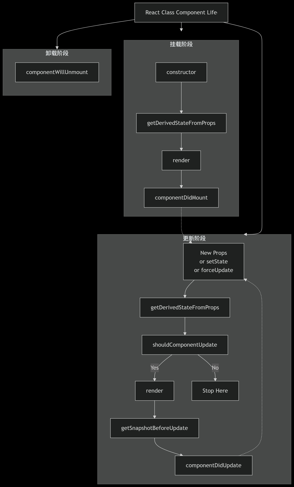

import { Aside } from '@astrojs/starlight/components';


## 心智模型

简而言之，`React`的心智模型有如下几个核心点：
 
- 声明式UI：使用`JSX`语法来对UI界面进行声明，更加关注页面`UI`最终的呈现效果，而无需过分关注交互过程中引起的每一处视图更新的具体实现

- 组件系统：`UI`是由独立、可复用、可组合的组件构成的，每个组件有如下特点：

  1. **独立 (Independent)**：组件应该遵循“高内聚，低耦合”的原则。一个设计良好的组件应该拥有明确的边界和职责，可以相对独立地被理解、开发和测试。

  2. **可复用 (Reusable)**：这是组件化的主要目标之一。通过将通用的UI和逻辑封装成组件（如`Button`, `Modal`, `InputField`），我们可以在项目的不同地方甚至不同项目中重复使用它们，极大地提高了开发效率和一致性。

  3. **可组合 (Composable)**：简单的组件可以被当作“积木”来组合成更复杂的组件，进而构建出整个页面和应用。这种树形结构的组合方式是`React`应用构建的基础，非常灵活和强大。

  4. **内聚 (Cohesive)**：在一个组件内部，`UI`（`JSX`）、逻辑（事件处理、副作用）和状态（`useState`, `useReducer`）是紧密关联、封装在一起的。它们共同完成了该组件的一个特定功能。这种内聚性使得代码更易于维护和理解，因为所有相关的代码都集中在同一个地方。

- “UI 是状态的函数”：`UI = f(state)`

- 函数式编程：

  1. **纯组件与纯函数（Pure Components & Pure Functions）**：理想中的React组件被设计为纯函数。给定相同的`props`和`state`，组件总是应该返回相同的JSX输出（即相同的渲染结果）。这种特性使得组件的行为非常可预测，易于测试和调试。

  2. **不可变性（Immutability）**：这是函数式编程的核心原则，也是`React`状态更新的黄金法则。状态（State）和属性（Props）绝不应该被直接修改（mutate）。更新状态时，必须使用`setState`或`useState`的`setter`函数创建一个新的对象或数组来代替旧的状态。
通过不可变性可以避免直接修改数据带来的副作用（Side Effects），使得状态变化可追踪、可预测，并极大地简化复杂状态变化的调试（例如，可以很容易地比较新旧状态对象）。

  3. **副作用与副作用隔离（Side Effects & Effect Hook）**：函数式编程追求纯函数，但数据获取、订阅、手动操作 DOM 等“副作用”在 UI 开发中是不可避免的。`React`通过`useEffect`Hook来明确地管理和隔离这些副作用，而不是将它们混入组件的核心渲染逻辑中。这保持了渲染逻辑的纯净性。

  4. **高阶函数与组合（Higher-Order Functions & Composition）**：React 推崇组合（Composition） 而非继承（Inheritance）。通过组合组件来构建UI，这本身就是一种函数式思想。自定义Hooks是这一思想的完美体现：它允许你将组件逻辑提取到可重用的函数中，这些函数本身就是纯函数或是对副作用的封装，实现了逻辑和表现的分离。

深入理解了这些要点后，使用`React`写出优质的代码是非常轻松的。


## 组件系统

组件系统是开发React的最核心部分，本章节主要介绍类组件/函数组件的一些核心特性和思想。

类组件在新版本的`React`中已不再推荐使用，但是这里还是记录一下相关的功能特性。

### 生命周期 LifeCycle

#### 类组件的生命周期

`React`中，仅有类组件存在所谓的生命周期。

`React`的生命周期可分为三个阶段：挂载、更新和卸载。

- 挂载：`constructor`、`getDerivedStateFromProps`、`render`、`componentDidMount`

- 更新： `getDerivedStateFromProps`、`shouldComponentUpdate`、`render`、`getSnapshotBeforeUpdate`、`componentDidUpdate`

- 卸载：`componentWillUnmount`

流程图示：



关于上面提及的生命周期方法，值得注意的有以下几个点：

1. `constructor`中的`super`:
   
   在`constructor`中使用`super`后，`constructor`中才能访问到`this`对象，如：`constructor`内部调用`super()`:
   
   ```js
   class ComponentA extends React.Component {
     constructor(props) {
       super();
       console.log(props); // {}
       console.log(this.props); // undefined
     }
   }
   ```
   
   `constructor`内部调用`super(props)`:
   
   ```js
   class ComponentA extends React.Component {
     constructor(props) {
       super(props);
       console.log(props); // {}
       console.log(this.props); // {}
     }
   }
   ```
   
   因为组件作为子类，没有自己的`this`对象，是需要继承父类的`this`的。虽然`React`在后面会帮我们完成这一过程（如在`render`中使用`this.props`），但在`constructor`阶段该过程并没有被执行，所以在调用`super`之前，都是拿不到`this`对象的。

2. 关于`getDerivedStateFromProps`
   
   这个方法的执行时机是组件的创建和更新阶段。在调用`render`方法之前，该方法会被调用。传入的参数有两个：第一个参数为`nextProps`，即变化后的`props`；第二个参数为`preState`，即改变前的`state`。
   
   一般我们会使用`getDerivedStateFromProps`来让组件在`props`变化时更新`state`。

3. 关于`shouldComponentUpdate`
   
   组件在每次触发更新前，都会调用`shouldComponentUpdate`。这个方法有两个参数，第一个参数为`nextProps`，第二个参数为`nextState`。方法的返回值为布尔类型，标识是否继续渲染。我们可以根据这个方法的两个参数的变化情况来对渲染进行控制，从而达到减少渲染，优化性能的目的。
   
   <Aside type="tip">在这个方法中不要使用`setState`对组件状态进行修改，会造成死循环。同样的，不要在`render`中进行`setState`操作。</Aside>

4. 关于`getSnapshotBeforeUpdate`
   
   这个方法并不是很常用到，它在`render`之后,`dom`改变之前执行，其返回值作为`componentDidUpdate`的第三个参数被接受，可以在组件更新前将组件的一些 UI 状态如滚动位置传给`componentDidUpdate`，从而实现组件 UI 状态的恢复。


#### 面试题：useEffect模拟实现生命周期

函数组件中没有`LifeCycle`的概念，不过我们可以根据`React`提供的一些`hooks`来模拟一部分的生命周期。

首先看一下`useEffect`的使用：

```js
useEffect(() => {
  // 依赖数组中依赖项变化时执行的逻辑
  return () => {
    // 组件销毁时调用的逻辑
  };
}, dep);
```

当`dep`为空时，`useEffect`仅会被执行一次，因此可以利用空依赖数组来模拟`componentDidMount`。相应的，`componentWillUnmount`也可以通过这种方式模拟，对应的逻辑写在`useEffect`第一个参数函数的返回值函数中。

如果我们在函数组件中想要监听`props`变化，也可以使用`useEffect`。我们只需将`props`注入依赖数组即可，这样可以在`props`变化时对组件内部维护的数据状态进行更新。

当`useEffect`中只传第一个参数时，在每次的函数组件执行的时候都会调用一次，可以利用这个特性来模拟`componentDidUpdate`。

### 数据状态：State和Props

State和Props组件内部UI渲染可能依赖的两部分数据。State由组件自身维护，而Props是组件外部传入的数据。

在类组件中，`state`通过`setState`改变；在函数组件中则使用`useState`进行组件内部状态的创建和维护。`props`数据由父组件传入子组件，这点不管是类组件还是函数组件都是一样的。

关于类组件的`setState`，有一些值得注意的点：

- `setState`有两个参数，第一个可以是对象，也可以是函数，用于状态的更新；第二个是更新完状态后的回调。

- 根据`setState`第一个参数的类型不同，相应的处理逻辑也有区别。
  
  - 如果第一个参数为函数类型，如：
    
    ```js
    this.setState((state, props) => {
      return { name: "XiaoMing" };
    });
    ```
    
    传入函数的参数为当前的`state`和`props`，`setState`内部会调用传入调用函数，返回值会和旧的`state`合并后再进行`state`的更新。
  
  - 如果第一个参数为对象类型，如：
    
    ```js
    this.setState({
      name: "XiaoMing",
    });
    ```
    
    传入的对象将会和旧的`state`合并后进行`state`的更新。

- `setState`的批量更新机制：
  
  例：类组件中的一个方法有如下的更新代码：
  
  ```js
  //假设 this.state.number 为 1
  this.setState(
    {
      number: this.state.number + 1,
    },
    () => {
      console.log(this.state.number);
    }
  );
  console.log(this.state.number);
  this.setState(
    {
      number: this.state.number + 1,
    },
    () => {
      console.log(this.state.number);
    }
  );
  console.log(this.state.number);
  this.setState(
    {
      number: this.state.number + 1,
    },
    () => {
      console.log(this.state.number);
    }
  );
  console.log(this.state.number);
  // 结果： 0 0 0 1 1 1
  ```
  
  可以看到，虽然调用的多次`setState`，最后`state`中的`number`值还是为 1。这是因为`React`中存在`State`批量更新的规则，几次对`state`的更新被合并为 1 次。
  
  注意，批量更新的规则在异步的代码如`Promise`、`setTimeout`中不管用，如果要在这些异步代码中使用批量更新，则需手动调用`ReactDOM`提供的`unstable_batchedUpdates`方法。
  
  另外，在这个机制下可以使用`flushSync`提升更新的优先级，当一个对`state`的更新在`flushSync`内部调用，这个更新的优先级是比较高的。如：
  
  ```js
  this.setState({ a: "xiaohong" });
  ReactDOM.flushSync(() => {
    this.setState({ a: "xiaoming" });
  });
  this.setState({ a: "xiaohuang" });
  ```
  
  执行上面代码，`state`会有两次更新，第一次是触发了`flushSync`，立马执行更新，之前的`setState`会被合并，`a`变为`xiaoming`；第二次是其他两行代码出发的更新，根据批量更新的规则，`a`变为`xiaohuang`。

关于`state`和`props`，还有一个经常被提及的概念：受控组件和非受控组件。其实很好理解，其区别在于控制组件中渲染数据的主体是哪个。如果组件渲染数据取决于其自身维护的状态，那就是非受控组件；如果组件渲染依赖于外部数据如`props`里的数据，即为受控组件。理解完这些后，啥时候该用，啥时候不该用心里也有数了。

### 组件通信

React的组件通信方式大致有下面几种：

- `props` + `callback`

- `ref`

- 状态管理（`redux`、`mobx`）

- `eventbus`

- `context`
 

#### props + callback

`props + callback`比较常用于父子组件通信，父组件通过`props`向子组件传值，子组件中也可以通过调用父组件传入的`callback`(实际上也是`props`的数据)来反馈数据给父组件。如：

```jsx
// father.jsx
function Father() {
    return <Son callback={(e) => {
        console.log(e)
    }/>
}


```

```jsx
// son.jsx
function Son({ callback }) {
    return <button onClick={ callback }></button>
}
```

#### ref

`ref`即`reference`的缩写，任何需要被引用的数据都可以保存在`ref`中，包括组件实例。

创建组件实例`ref`的形式有三种：

- (类组件)传入字符串：使用时通过 `this.refs.xxx`的格式获取对应的元素（已不推荐使用）

- (类组件)传入对象：传入`ref`的对象是使用`React.createRef()` 方式创建出来，使用时获取到创建的对象中存在 `current` 属性即为对应的元素，如：
  
  ```js
  class MyComponent extends React.Component {
    constructor(props) {
      super(props);
      this.myRef = React.createRef();
    }
    render() {
      return <div ref={this.myRef} />;
    }
  }
  ```

- (类组件)传入函数，该函数会在`DOM`被挂载时进行回调，这个函数会传入一个元素对象，可以自己保存，使用时，直接拿到之前保存的元素对象即可。如：
  
  ```js
  class MyComponent extends React.Component {
    constructor(props) {
      super(props);
      this.myRef = React.createRef();
    }
    render() {
      return <div ref={(element) => (this.myref = element)} />;
    }
  }
  ```

- (函数组件)使用`useRef()`：函数组件使用`ref`的方式，如：
  
  ```js
  function App(props) {
    const myref = useRef();
    return (
      <>
        <div ref={myref}></div>
      </>
    );
  }
  ```
  对于函数组件而言，使用`ref`时，要配合`forwardRef`和`useImperativeHandle`一起用。用法见下面的代码：

  ```js
  // Son.jsx
  const { useState, useRef, forwardRef, useImperativeHandle } = React;

  const Son = forwardRef((props, ref) => {
    const [message, setMessage] = useState("");

    useImperativeHandle(ref, () => {
      return {
        setMessage,
      };
    });

    return (
      <div class="son">
        <h1>子组件</h1>
        <div>子组件内部状态message：{message}</div>
      </div>
    );
  });
  ```
  ```jsx
  // Father.jsx
  export default () => {
    const sonRef = useRef(null);

    const changeInput = (e) => {
      sonRef.current.setMessage(e.target.value);
    };

    return (
      <div class="father">
        <h1>父组件</h1>
        <span>父组件input: </span>
        <input class="input" onChange={changeInput} />
        <Son ref={sonRef} />
      </div>
    );
  };
  ```

  ```css
  // index.css
  .father,
  .input {
    background: white;
    color: black;
  }
  .father {
    padding: 20px;
  }
  .son {
    margin-top: 20px;
    border: 1px solid black;
    padding: 10px;
  }
  ```
  <Aside type="tip">
  `React 19`开始，`forwardRef`已经被废弃，可以不使用`forwardRef`，参考：https://react.docschina.org/reference/react/forwardRef。
  </Aside>

#### 状态管理

对于状态共享比较复杂的系统，可以使用状态管理工具如：`redux`、`mobx`、`zustand`等）。

#### Context

`React`的`Context`是一种在组件树中共享数据的方法，可以避免通过`props`层层传递数据的繁琐操作。通过`Context`，我们可以将某个组件下需要共享的数据传递给所有子组件，无论它们在组件树中的哪个位置，而不需要一层层地传递属性。

<Aside type='caution'>使用`Consumer`的组件必须是`Provider`的后代组件，否则无法获取共享的数据。如果在组件树中没有找到对应的`Provider`，`Consumer`会使用`defaultValue`。</Aside>

类组件使用`Context`传值示例：

```jsx
const ThemeContext = React.createContext(null);
const ThemeProvider = ThemeContext.Provider; //提供者
const ThemeConsumer = ThemeContext.Consumer; // 订阅消费者
// 类组件 - contextType 方式
class ConsumerDemo extends React.Component {
  render() {
    const { color, background } = this.context;
    return <div style={{ color, background }}>消费者</div>;
  }
}
ConsumerDemo.contextType = ThemeContext;

const Son = () => <ConsumerDemo />;

export default function ProviderDemo() {
  const [contextValue, setContextValue] = React.useState({
    color: "#ccc",
    background: "pink",
  });
  return (
    <div>
      <ThemeProvider value={contextValue}>
        <Son />
      </ThemeProvider>
    </div>
  );
}
```

函数组件使用`Context`传值示例：

```jsx
const { useState, useRef, useContext, createContext } = React;

const Context = createContext();

const Son = (props) => {
  const value = useContext(Context);
  return (
    <div class="son">
      <h1>子组件{props.index || 0}</h1>
      <div>{value}</div>
    </div>
  );
};

export default () => {
  const [message, setMessage] = useState("");

  return (
    <Context.Provider value={message}>
      <div class="father">
        <h1>父组件</h1>
        <span>输入数据：</span>
        <input class="input" onChange={(e) => setMessage(e.target.value)} />

        <Son index="1" />
        <Son index="2" />
      </div>
    </Context.Provider>
  );
};
```

### 组件逻辑复用：高阶组件 HOC

`HOC`（`Higher-Order Component`）是指一个函数，接受一个组件作为参数并返回一个新的组件。`HOC`可以在不修改现有组件代码的情况下添加新的功能，例如可以将逻辑代码和状态管理代码从组件中抽离出来，提高代码复用性。

下面是一个简单的例子：

```jsx
// example.jsx
function withWindowSize(Component) {
  return class extends React.Component {
    state = { width: window.innerWidth, height: window.innerHeight };
    handleResize = () => { this.setState({ width: window.innerWidth, height: window.innerHeight }); };
    componentDidMount() { window.addEventListener('resize', this.handleResize); }
    componentWillUnmount() { window.removeEventListener('resize', this.handleResize); }
    render() {
      return <Component windowSize={this.state} {...this.props} />;
    }
  };
}

// 使用
const MyComponent = (props) => {
  const { windowSize } = props;
  return <div>Window size: {windowSize.width} x {windowSize.height}</div>;
};
export default withWindowSize(MyComponent);
```

### 组件逻辑复用：React hooks

在没有`React Hook`之前，函数组件能够做的只是接受`Props`、渲染`UI`，以及触发父组件传过来的事件。`React Hook`让函数组件也能做类组件的事情，有自己的状态，可以处理一些副作用，能获取`ref`，也能做数据缓存。

从`React`团队的开发方向来看，虽然其在文档上表明并没有移除`class`组件的意思，不过也看得出官方更推荐使用函数组件。可见：[动机 | Hook ｜ React 中文文档](https://react.docschina.org/docs/hooks-intro.html#motivation)

使用`React Hook`要留意下面几个点：

- 以`use`开头的函数均会被`React`视作一个`Hook`（官方提供的`linter`有这个规则）

- 仅能在函数组件或者其他`Hook`内部被使用

- 不要在循环，条件或嵌套函数中调用`Hook`， 确保总是在你的`React`函数的最顶层调用他们。遵守这条规则，你就能确保 Hook 在每一次渲染中都按照同样的顺序被调用。

`React Hook`有如下优点：

1. 可以将状态逻辑和`UI`逻辑分离，使代码更加清晰易懂。

2. 可以将相同的逻辑应用于多个组件，从而实现代码的复用。

3. 可以使用自定义`hooks`，将复杂的逻辑抽象出来，使代码更加模块化。

### 函数组件：常用hooks

#### 状态类

状态类的hooks有两个：`useState`、`useReducer`、`useContext`。

##### useState

`useState`可以让函数组件具有状态（state）的能力。它接收一个初始值作为参数，返回一个包含`state`和更新`state`的函数的数组。每次调用更新函数时，`React`会重新渲染组件，并重新计算组件的`UI`。

一个简单的调用示例如下：

```js
const [state, setState] = useState(initialState);
```

其中，`state`表示当前状态的值，`initialState`表示初始值。`setState`是一个更新`state`的函数，它可以接收一个新的值，并触发组件的重新渲染。

`useState`的特点包括：

- 可以在函数组件中添加状态，避免了使用类组件的繁琐；

- 可以多次使用`useState`，每个`state`之间是独立的；

- 每次修改`state`都会重新渲染组件，但`React`会尽可能地优化性能，避免不必要的渲染；

- 更新`state`可以使用函数式更新，避免了异步更新带来的问题。


##### useReducer

`useReducer`用于管理组件中的状态。它的作用类似于`useState`，可以用来更新组件中的状态。但是，相较于`useState`，`useReducer`更适合处理复杂的状态逻辑，例如多个状态之间的关系、状态的计算逻辑等。

`useReducer`接受两个参数：`reducer`函数和初始状态。`reducer`函数接受两个参数，一个是当前状态，一个是操作指令，根据操作指令对当前状态进行更新，并返回新的状态。通过调用`dispatch`函数，组件可以将操作指令传递给`reducer`函数，从而更新状态。

用法示例如下:

```js
const { useReducer } = React;

const initialState = {
  count: 0,
};

function reducer(state, action) {
  switch (action.type) {
    case "increment":
      return { ...state, count: state.count + 1 };
    case "decrement":
      return { ...state, count: state.count - 1 };
    default:
      throw new Error("Invalid action type");
  }
}

export default () => {
  const [state, dispatch] = useReducer(reducer, initialState);

  return (
    <div>
      <h1>Count: {state.count}</h1>
      <div style={{ display: "flex", columnGap: 10 }}>
        <button onClick={() => dispatch({ type: "increment" })}>+</button>
        <button onClick={() => dispatch({ type: "decrement" })}>-</button>
      </div>
    </div>
  );
};
```

<Aside type="tip">
我们可以用`useState`实现一个`useReducer`：

```jsx
import { useState } from "react";

function useReducer(reducer, initialState) {
  const [state, setState] = useState(initialState);

  function dispatch(action) {
    const nextState = reducer(state, action);
    setState(nextState);
  }

  return [state, dispatch];
}
```

</Aside>


##### useContext


在前面组件通信的内容中我们了解了`React`的`Context API`,`useContext`的作用就是允许我们在函数组件中消费`Context`。

`useContext`接收一个`Context`对象并返回该`Context`的当前值。如果我们使用了`useContext`，则当`Context`的值更改时，组件将会重新渲染。

例如：

```jsx
// 1. 创建一个 Context 对象（通常在一个单独的文件中）
import { createContext, useContext } from 'react';

const ThemeContext = createContext('light'); // 'light' 是默认值

function App() {
  // 2. 在顶层组件使用 Provider 提供 value
  return (
    <ThemeContext.Provider value="dark"> {/* 覆盖默认值 */}
      <Toolbar />
    </ThemeContext.Provider>
  );
}

function Toolbar() {
  // 中间的组件完全不需要传递任何关于 theme 的 props
  return (
    <div>
      <ThemedButton />
    </div>
  );
}

function ThemedButton() {
  // 3. 在深层子组件中，使用 useContext 消费 value
  const theme = useContext(ThemeContext);
  return <button className={theme}>I am styled by theme: {theme}</button>;
  // 最终，这个按钮的 className 会是 "dark"
}
```

#### 副作用类

##### useEffect

`useEffect`用于在组件渲染完成后执行一些副作用操作，例如异步数据请求、DOM 操作等。

`useEffect`接受两个参数，第一个参数是一个回调函数，用于定义需要执行的副作用操作，可以在这个函数的返回值指定一个函数，指定的函数会在组件卸载阶段执行；第二个参数是一个数组，用于指定副作用操作依赖的数据，当这些数据发生变化时，`useEffect`才会重新执行。

使用示例如下：

```jsx
import { useState, useEffect } from 'react';

function UserProfile({ userId }) {
  const [user, setUser] = useState(null);
  const [loading, setLoading] = useState(true);
  const [error, setError] = useState(null);

  useEffect(() => {
    // 异步数据获取函数
    const fetchUser = async () => {
      try {
        setLoading(true);
        const response = await fetch(`/api/users/${userId}`);
        const userData = await response.json();
        setUser(userData);
      } catch (err) {
        setError(err.message);
      } finally {
        setLoading(false);
      }
    };

    fetchUser();
  }, [userId]); // 依赖数组：当 userId 变化时重新执行

  if (loading) return <div>Loading...</div>;
  if (error) return <div>Error: {error}</div>;
  
  return (
    <div>
      <h1>{user.name}</h1>
      <p>{user.email}</p>
    </div>
  );
}
```

##### useLayoutEffect
 
`useLayoutEffect`也被用来处理副作用操作，但和`useEffect`有区别。`useEffect`被异步调度，当页面渲染完成后再去执行，不会阻塞页面渲染；`useLayoutEffect`是在commit阶段新的DOM准备完成，但还未渲染到屏幕之前，同步执行。

当`useEffect`里面的操作需要处理`DOM`，并且改变页面的样式，建议使用`useLayoutEffect`，否则可能会出现出现闪屏问题。


使用示例如下：

```jsx
function Tooltip() {
  const [height, setHeight] = useState(0);
  const tooltipRef = useRef(null);

  useLayoutEffect(() => {
    // 同步测量 DOM
    const { height } = tooltipRef.current.getBoundingClientRect();
    setHeight(height); // 同步更新状态，触发同步的重新渲染
    // 此时，浏览器还没有绘制，所以用户看不到中间状态
  }, []);

  // 组件的渲染逻辑可以根据 height 来调整位置
  // ...
  return <div ref={tooltipRef}> {/* ... */} </div>;
}
```

#### 优化类

##### useMemo

`useMemo`用于缓存计算结果，避免重复计算。useMemo 接收两个参数，第一个参数是计算函数，第二个参数是依赖项数组。只有当依赖项数组中的值发生变化时，计算函数才会重新执行。

使用示例如下：

```jsx
import React, { useMemo } from 'react';

function ExpensiveComponent({ list, filterTerm }) {
  // 只有当 `list` 或 `filterTerm` 变化时，才会重新执行昂贵的过滤计算
  const filteredList = useMemo(() => {
    console.log('正在进行昂贵的计算...');
    return list.filter(item => item.name.includes(filterTerm));
  }, [list, filterTerm]); // 依赖项

  return (
    <div>
      {filteredList.map(item => <div key={item.id}>{item.name}</div>)}
    </div>
  );
}
```

<Aside type='caution'>

请避免滥用`useMemo`，否则可能会造成负优化，参考：https://react.docschina.org/reference/react/useMemo#skipping-expensive-recalculations 。
</Aside>


##### useCallback

`useCallback`用于缓存函数，避免重复创建。useCallback 接收两个参数，第一个参数是回调函数，第二个参数是依赖项数组。只有当依赖项数组中的值发生变化时，回调函数才会重新创建。

<Aside type="tip">
可以吧`useCallback`看作一种语法糖，因为其作用使用`useMemo`也能实现，不过就是麻烦点。下面是基于`useMemo`实现的`useCallback`：

```jsx
import { useMemo } from "react";

function useCallback(callback, dependencies) {
  const memoizedCallback = useMemo(() => callback, dependencies);
  return memoizedCallback;
}
```
</Aside>

使用示例如下：

```jsx
import React, { useCallback, useState } from 'react';
// 一个用 React.memo 优化过的子组件，只有当 props 变化时才会重渲染
const ChildButton = React.memo(({ onClick, children }) => {
  console.log('子组件被渲染了:', children);
  return <button onClick={onClick}>{children}</button>;
});

function ParentComponent() {
  const [count, setCount] = useState(0);
  const [name, setName] = useState('');

  // 没有 useCallback：每次 ParentComponent 渲染，handleIncrement 都是新函数
  // const handleIncrement = () => setCount(c => c + 1);

  // 有 useCallback：依赖项 [] 不变，handleIncrement 的函数引用始终不变
  const handleIncrement = useCallback(() => setCount(c => c + 1), []);

  return (
    <div>
      <input value={name} onChange={(e) => setName(e.target.value)} />
      <p>Count: {count}</p>
      {/* 即使 ParentComponent 因为 input 输入而重渲染，
          handleIncrement 的引用不变，不会导致 ChildButton 不必要的重渲染 */}
      <ChildButton onClick={handleIncrement}>Increment</ChildButton>
    </div>
  );
}

```

##### 闭包陷阱

使用`useMemo`、`useCallback`的时候，有时会出现如下的问题：在内部包裹的函数于外部的state形成闭包，而依赖数组却没有包含该值，导致调用缓存的函数时函数中获取到的state值不是最新的。如果依赖数组包含该值，而这个值经常变动，又会失去使用`useMemo`和`useCallback`进行性能优化的意义。

解决这个问题可以从两个方面入手：

- 非必要不使用`useMemo`和`useCallback`进行性能优化

- 利用`useRef`的特性，把函数放在ref里，如：

  ```jsx
  const App = () => {
    const [name,setName] = useState("");
    const fnRef = useRef();
    fnRef.current = function() {
        console.log(name)
    }
    const onClick = useCallback(() => {
        fnRef.current();
    },[])
    return (
        <button onClick={onClick}>Click</button>
    )
  }
  ```


#### 引用类

##### useRef

`useRef`是 React 中的一个 Hook 函数，它可以创建一个可变的引用对象，一般用于定义组件引用和`DOM`引用。

`useRef`返回一个对象，该对象的`current`属性包含一个变量，可以存储任何值。与`useState`不同的是，`useRef`不会引起组件重新渲染。

`useRef`的主要作用是保存组件中的状态，以供后续的组件使用，也可以用来获取`DOM`元素和组件实例的引用，后者在实际开发中用的比较多。

下面是一个简单的示例：

```js
const { useRef } = React;

export default () => {
  const inputRef = useRef(null);

  const handleClick = () => {
    inputRef.current.focus();
  };

  return (
    <div style={{ display: "flex", columnGap: 10 }}>
      <input type="text" ref={inputRef} />
      <button onClick={handleClick}>Focus Input</button>
    </div>
  );
};
```

##### useImperativeHandle

`useImperativeHandle`的作用是自定义一个组件实例暴露给其父组件的`ref`值。它让父组件能够通过`ref`调用子组件中定义可供外部访问的特定方法或特定的值，而不是直接访问子组件的`DOM`节点或完整的实例。

用法示例如下：

```jsx
// React 18 及以前的写法
import { forwardRef, useImperativeHandle } from 'react';

const MyInput = forwardRef((props, ref) => {
  useImperativeHandle(ref, () => ({
    // ...暴露的方法
  }));
  return <input />;
});
```
```jsx
// ✅ React 19 的新写法（推荐）
function MyInput({ ref, ...props }) {
  useImperativeHandle(ref, () => ({
    // ...暴露的方法
  }));
  return <input />;
}

// 旧的 forwardRef 写法依然有效，但不再需要
```

## 事件机制

`React`实现了一套自己的事件机制，称为合成事件（SyntheticEvent）。这是一种跨浏览器的事件包装器，提供了与原生事件相同的接口，但具有更好的兼容性和性能。

### 核心特性

- 事件委托：`React`将所有事件委托到文档的顶层处理，而不是直接绑定到特定元素

- 跨浏览器兼容：合成事件在所有浏览器中表现一致

- 冒泡机制：`React`事件使用标准的冒泡机制，与`DOM`规范一致

### 事件执行顺序

捕获（原生）-> 捕获（合成）-> 冒泡（原生）-> 冒泡（合成）

### 版本差异

- `React 16`及之前：事件委托到`document`，所有事件冒泡到document层处理
 
- `React 17`及之后：事件委托到`React`树的根容器
