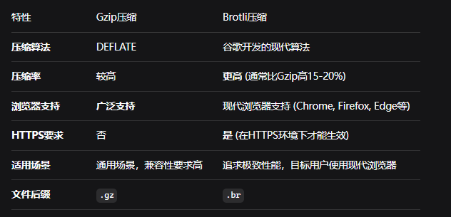

本文主要记录日常开发使用`Vite`时进行构建产物体积/构建速度层面的优化过程的一些最佳实践，包括插件使用/编码优化/构建配置等。

## 构建产物优化

### 分析产物体积

我们需要借助一些工具来更直观的分析打包产物，推荐如下的几个`Vite`插件：

- `vite-bundle-analyzer`: 提供类似`Webpack Bundle Analyzer`的体验，可视化构建产物体积分析。[nonzzz/vite-bundle-analyzer](https://github.com/nonzzz/vite-bundle-analyzer)

- `vite-plugin-stats-html`: 构建后可以针对产物生成静态报告，包含总体积、文件数量、第三方依赖数、饼图等。[HongqingCao/vite-plugin-stats-html](https://github.com/HongqingCao/vite-plugin-stats-html)

在分析产物构成时，可以主要关注下面几点：
 
- 引入的第三方库是否过大：考虑是否可用更轻量的库替代，或只引入需要的部分（按需引入）。

- 代码分割是否合理：利用动态导入（`Dynamic Imports`）拆分代码，避免单个文件过大。

- 是否存在重复依赖：不同版本的同名库或未被正确`Tree-shaking`的代码。

- 压缩和混淆：确认生产构建的代码已被有效压缩。

### Source Map

`Source Map`文件存储了代码打包转换后的位置信息映射关系，用于混淆后的代码还原。

生产环境下，构建产物一般不需要包括`Source Map`，而`Vite`默认构建产物生成`Source Map`，可以进行关闭。

```js
// vite.config.js
export default {
  build: {
    sourcemap: false // 确保关闭了 sourcemap 生成
  }
  // ... 其他配置
}
```

对于大型项目而言，关闭`Source Map`的产物体积减少比例通常在`10%`到`30%`左右，而且打包速度也会提升，可以说是非常直观的优化。

### 代码分割

代码分割的收益主要在于提升加载速度上，通过对产物进行细粒度拆分 + 按需引入，可以让首屏加载的资源更加少，速度提升也会很明显。

下面从开发编码/构建配置两个维度探讨如何做好代码分割。

#### 编码阶段：使用动态导入import()/import.meta.glob

##### import()

生产构建时，`Vite`会将每个`import()`识别为一个代码分割点。这意味着`import()`导入的模块及其依赖会被打包成一个独立的`chunk`文件。

通过`import()`，可以将应用分割成多个较小的`chunk`，并在需要时再加载这些`chunk`，从而显著减少应用的初始加载时间。

比较常用的实践是`Vue`/`React`懒加载组件，以`Vue`为例：

```js
// 路由懒加载示例
const Home = () => import('./views/Home.vue')
const About = () => import('./views/About.vue')
```

##### import.meta.glob

`import.meta.glob`允许通过一个`glob`模式（类似于文件路径匹配规则）来批量导入模块。

如：

```js
const modules = import.meta.glob('./dir/*.js')
```

`Vite`在构建时会进行处理，转换为：

```js
// Vite 构建后生成的代码
const modules = {
  './dir/foo.js': () => import('./dir/foo.js'),
  './dir/bar.js': () => import('./dir/bar.js')
}
```

#### 构建阶段：配置 manualChunks

配置示例：

```js
// vite.config.js
import { defineConfig } from 'vite';

export default defineConfig({
  build: {
    rollupOptions: {
      output: {
        manualChunks(id) {
          if (id.includes('node_modules')) {
            // 将 node_modules 中的依赖单独打包到 vendor 中
            return 'vendor';
          }
        }
      }
    }
  }
});
```

通过`manualChunks`对构建产物进行优化的目标如下：

1. 优化缓存利用率：将变更频率不同的代码分离，**利用浏览器缓存**，使用户不必重复下载未变化的代码。

2. 控制资源加载优先级：将关键资源与非关键资源分离，优先加载核心内容。


##### 三方库拆分

将一些巨大的、独立的库（如`echarts`、`xlsx`）单独打包，其余的再合并。

如：

```js
manualChunks(id) {
  if (id.includes('node_modules')) {
    // 1. 将指定的大型库单独拆分
    if (id.includes('echarts')) {
      return 'echarts';
    }
    if (id.includes('xlsx')) {
      return 'xlsx';
    }
    if (id.includes('three')) {
      return 'three';
    }

    // 2. 将框架（react + react-dom）和核心运行时库（如 redux, react-router）打包在一起
    if (id.includes('react') || id.includes('redux') || id.includes('react-router')) {
      return 'react-vendor';
    }

    // 3. 将其他的第三方依赖打包到另一个 chunk
    return 'vendor';
  }

  // 4. 将项目中的公共工具函数/组件也单独拆分
  if (id.includes('src/utils/') || id.includes('src/components/')) {
    return 'common';
  }
}
```

日常开发中，除非三方依赖版本升级，`react-vendor`、`echarts`等`chunk`几乎不会改变，缓存命中率极高。

过度拆分`chunk`有时也会有负收益（生成几十个甚至上百个小`chunk`，导致浏览器并行加载资源数达到上限（`HTTP/1.1`约`6-8`个），引发排队等待，反而拖慢加载速度）。因此，对于大量的体积较为小的三方库，打包到一个`vendor`中通常是更好的选择。


### 代码压缩

#### terser和esbuild的取舍

`Vite`内置两种压缩器的支持：`esbuild`和`terser`，默认使用`esbuild`。

`esbuild`基于`Go`，比`terser`快`20-40`倍，压缩率只差`1%-2%`。([构建选项 | Vite 官方中文文档](https://cn.vite.dev/config/build-options.html#build-minify))

在需要产物极致压缩的场景而不在意多出来的构建时间时，可以考虑放弃`esbuild`，使用`terser`以获得更小的代码体积提升。

#### 调试代码移除

开发过程中可能会编写一部分调试代码（`console`和`debugger`等），生产构建这部分代码一般不被需要，可以移除出去。

以`esbuild`为例，可以通过`drop`属性来配置生产构建移除`console`和`debugger`：

```js
import { defineConfig } from 'vite'

export default defineConfig({
  build: {
    minify: 'esbuild', // Vite 默认即为 'esbuild'
    // 可选：针对 ESBuild 的更细粒度配置
    esbuild: {
      minifyIdentifiers: true,    // 压缩标识符
      minifySyntax: true,        // 压缩语法
      minifyWhitespace: true,    // 压缩空白
      // 移除特定的代码，如 console 和 debugger
      drop: ['console', 'debugger'], 
    },
  },
})
```

### 依赖外部化

举一个例子：一个首页中有很多个图表卡片，这部分卡片实际是远程组件，并非主应用的组件。每个卡片单独进行构建步骤，如果这时候把依赖都单独打包（比如`echarts`），那么单个卡片组件的体积就会非常大。

可以通过依赖外部化的形式去解决这个问题，对于每个卡片的构建步骤，构建时不需要把大依赖打包进去，运行时通过`window`对象获取主应用对应的依赖，从而大幅减小单个组件的体积。

另一种场景: 部分库通过其他方式（如 CDN）在运行时引入。

配置示例：

```js
import { defineConfig } from 'vite'

export default defineConfig({
  build: {
    rollupOptions: {
      // 指定需要外部化的依赖
      external: ['vue', 'react', 'react-dom', 'lodash'], // 添加你的依赖名称
      output: {
        // 为 UMD 格式的产物提供全局变量名
        globals: {
          vue: 'Vue',
          react: 'React',
          'react-dom': 'ReactDOM',
          lodash: '_'
        }
      }
    }
  }
})
```

### 图片压缩

一般使用`vite-plugin-imagemin`插件进行图片压缩，配置示例如下：

```js
import { defineConfig } from 'vite'
import viteImagemin from 'vite-plugin-imagemin'

export default defineConfig(({ command }) => {
  const isBuild = command === 'build' // 判断是否为生产环境构建

  return {
    plugins: [
      viteImagemin({
        // 启用缓存，提升二次构建速度
        cache: true,
        // 仅在生产环境构建时启用压缩
        disable: !isBuild,
        // 在控制台输出压缩详情
        verbose: true,
        // 配置各类图片的压缩参数
        gifsicle: {
          interlaced: true,    // 隔行扫描，优化加载体验
          optimizationLevel: 3 // 优化级别 (0-7)
        },
        optipng: {
          optimizationLevel: 5 // PNG优化级别 (0-7)
        },
        mozjpeg: {
          quality: 80,      // JPEG质量 (0-100)
          progressive: true // 渐进式加载
        },
        pngquant: {
          quality: [0.8, 0.9], // PNG质量范围 [min, max] (0-1)
          speed: 4           // 压缩速度 (1-11, 越快压缩率越低)
        },
        svgo: {
          plugins: [
            { name: 'removeViewBox', active: false }, // 保留viewBox
            { name: 'removeEmptyAttrs', active: true } // 移除空属性
          ]
        },
        webp: {
          quality: 80,   // WebP质量 (0-100)
          lossless: false, // 是否无损压缩
          method: 6      // 压缩方法 (0-6)
        }
      })
    ]
  }
})
```

对于部分较大的图片，推荐手动先转为`webp`格式，也可以减小最终产物大小。

### 产物压缩

将最终产物中的**文本类文件**进行压缩，可以**显著降低**产物的体积。一般常用的压缩算法有`GZip`和`Brotli`，两种压缩算法的对比如下表：



`Vite`中使用`vite-plugin-compression`来进行最终产物压缩（[vbenjs/vite-plugin-compression: Use gzip or brotli to compress resources](https://github.com/vbenjs/vite-plugin-compression)）。

例如：

```js

import { defineConfig } from 'vite'
import viteCompression from 'vite-plugin-compression' 

export default defineConfig({
  plugins: [
    // Gzip 压缩配置
    // viteCompression({
    //  algorithm: 'gzip', // 使用 gzip 算法
    //  ext: '.gz', // 压缩文件后缀为 .gz
    //  threshold: 10240, // 仅压缩大于 10KB 的文件
    //  deleteOriginFile: false, // 压缩后是否删除原始文件
    // }),
    // Brotli 压缩配置
    viteCompression({
      algorithm: 'brotliCompress',
      ext: '.br',
      threshold: 10240,
      deleteOriginFile: false, // 通常不建议删除源文件
    }),
  ],
})
```

静态资源服务器也需要配置相应的压缩算法支持，以`nginx`为例，配置如下（参考[Nginx 开启 Brotli 压缩算法 - -零 - 博客园](https://www.cnblogs.com/-wenli/p/13594882.html)）：

```nginx
http {
    ...
    # gzip
    gzip on;
    gzip_min_length 1k;
    gzip_buffers 4 32k;
    gzip_http_version 1.1;
    gzip_comp_level 5;
    gzip_types text/plain text/css application/json application/x-javascript text/xml application/xml application/xml+rss text/javascript application/javascript;
    gzip_vary on;
    gzip_proxied any;
    gzip_disable "MSIE [1-6]\.";

    # brotli
    brotli on;
    brotli_comp_level 6;
    brotli_buffers 16 8k;
    brotli_min_length 20;
    brotli_types text/plain text/css application/json application/x-javascript text/xml application/xml application/xml+rss text/javascript application/javascript image/svg+xml;
    ...
}
```

## 构建性能优化

### 大型组件预热

对于没有进行依赖预构建的文件，`Vite`在发起请求时才会进行文件转换，如果该文件的转换比较耗时，加载就比较慢。

`Vite`提供了`server.warmup`，允许我们对大型组件/频繁使用的文件进行预热：

```js
// vite.config.js
export default defineConfig({
  server: {
    warmup: {
      clientFiles: [
        './src/components/LargeComponent.vue',
        './src/utils/heavy-utils.js',
      ],
    },
  },
})

```

当请求时，`heavy-utils.js`将准备好并被缓存，以便立即提供服务。

### 避免使用“桶文件”

“桶文件”是一个通常命名为`index.js`或`index.ts`的文件，它的唯一目的是从一个目录中重新导出（`re-export`）其他文件的内容。这是一种常见的代码组织方式，旨在让导入变得更简洁。

文件结构类似于：

```text
src/
  components/
    Button.tsx
    Input.tsx
    Modal.tsx
    index.ts  // <- 桶文件
```

当执行`import { Button } from '../components'`时，`Vite`的模块解析器必须先加载并分析整个桶文件（`index.ts`）。桶文件又导入了`Button`、`Input`、`Modal`三个模块。这意味着，即使你只想用`Button`，`Vite`也必须在开发服务器启动时，将整个`components`目录下的所有被导出的模块都关联起来并进行初步处理。

因此，官方文档在性能章节推荐避免使用“桶文件”。


