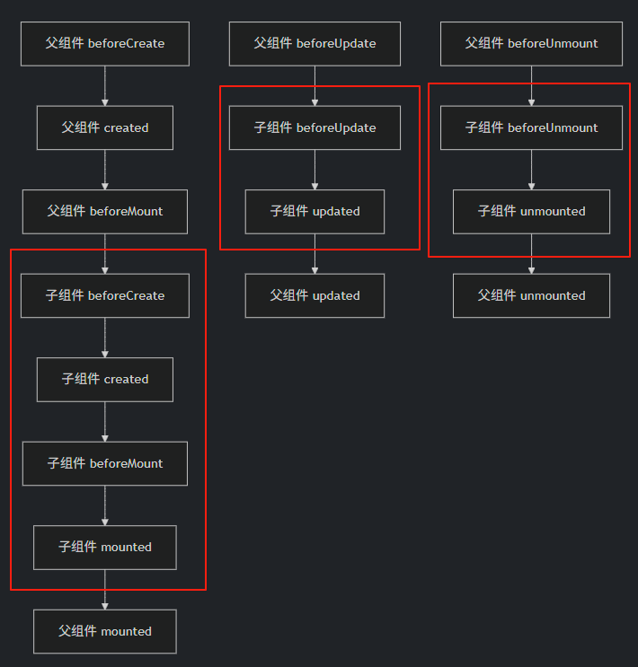
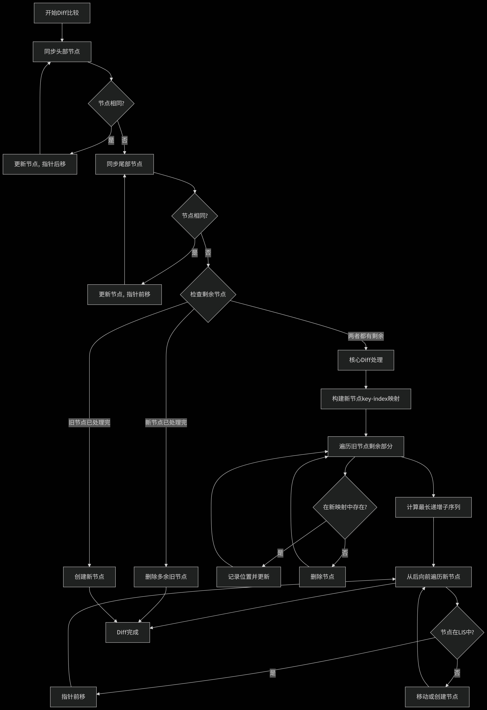

## 生命周期

### 四个阶段：创建、挂载、更新、卸载

创建阶段：`setup`（组合式）、`beforeCreate` -> `created`（选项式）

挂载阶段：`beforeMount` -> `mounted`

更新阶段：`beforeUpdate` -> `updated`

卸载阶段：`beforeUnmount` -> `unmounted`

### 父子组件生命周期

如下图：



有如下结论：

1. 创建/挂载阶段：父组件挂载开始时才会对子组件进行创建以及挂载，父组件下所有子组件挂载完成后，才会出发父组件的`mounted`钩子

2. 更新/卸载阶段：父组件执行更新/卸载 -> 子组件执行更新/卸载 -> 子组件更新/卸载完成 -> 父组件更新/卸载完成

## 响应式原理

### ref 和 reactive

组合式`API`中对响应式变量进行定义有两个`API`: `ref` 和 `reactive`。

两者用法有如下差异：

- 使用`ref`声明的变量内部数据在`setup`函数中需要通过`.value`进行访问，但在组件`template`中使用则不需要；调用`reactive`返回一个`Proxy`类型的对象，可以直接访问属性值。
- `reactive`只能用于对象类型, 不能用于基本数据类型

### 计算属性

计算属性对象是一种特殊的响应式对象，在组合式`API`中，传入`computed`的是一个函数，函数的返回值是一个根据其他响应式变量（定义的`ref/reactive`变量/组件外部传入的props等）计算的结果。调用`computed`返回的结果是一个只读的`Ref`对象，在`setup`函数中同样需要通过`.value`属性访问内部值。

### 数据绑定方式

单向绑定：`v-bind`（父组件传入子组件）

双向绑定：`v-model`（语法糖，等价于`v-bind` + 自定义事件）

组合式`API`相关能力：`defineModel`

### Vue3的响应式实现

#### getter / setters

在`ref`的实现中，对外层的`value`对象采用`getter/setters`进行读写追踪，如：

```js
function ref(value) {
  const refObject = {
    get value() {
      track(refObject, 'value')
      return value
    },
    set value(newValue) {
      value = newValue
      trigger(refObject, 'value')
    }
  }
  return refObject
}
```

#### Proxy/Reflect

在`reactive`的实现中，对象类型数据的响应式实现采用`Proxy/Reflect`实现。

`Proxy`：对目标对象进行代理，拦截其操作（如读取`get`、修改`set`、删除`deleteProperty`等）。

`Reflect`：操作对象的工具方法，与`Proxy`拦截器一一对应，保证操作行为的默认正确性。

使用例子如下：

```js
const proxy = new Proxy(target, {
  get(target, key, receiver) {
    return Reflect.get(target, key, receiver);
  },
  set(target, key, value, receiver) {
    return Reflect.set(target, key, value, receiver);
  }
});
```

### 优化API：shallowRef、shallowReactive

`vue3`的响应式系统默认是深度的，对于层级较深的复杂对象而言，可能会造成一部分性能负担。

有的场景下我们不需要对复杂对象进行深层次监听，为此`vue3`提供了`shallowRef`、`shallowReactive`这两个`API`。

1. `shallowRef`
    - 场景：大型对象/数组的整体替换、第三方库实例（如`DOM`元素）管理、与渲染无关的临时状态。

    - 收益：跳过深层响应式转换，仅响应`.value`引用变化，提升初始化性能，减少内存开销。

2. `shallowReactive`

    - 场景：仅需响应顶层字段变化（如高频更新的坐标数据）、配合不可变数据结构、表单配置对象。

    - 收益：只追踪第一层属性，避免嵌套属性的冗余依赖收集，优化高频更新性能。

通过这两个`API`能精准控制响应层级，避免深度递归的性能损耗，适用于数据量大而复杂、更新频繁或非深度响应场景。

### 其他问题

1. 为什么`data`属性是一个函数而不是一个对象？

    在`vue2`中，`data`属性定义为函数，`vue`会把函数调用的结果作为组件实例对象的数据，保证同一组件的不同实例对象数据不互相干扰。

    另外 `vue3`目前已经不再支持`data`属性直接定义一个对象，会有警告: `The data option must be a function. Plain object usage is no longer supported.`。源码见：[core/packages/runtime-core/src
/componentOptions.ts](https://github.com/vuejs/core/blob/main/packages/runtime-core/src/componentOptions.ts)

## 组件通信

场景：多组件共享数据、某个组件数据更新后其他组件需要进行感知

分类：

- 父子组件通信：
  - 父 -> 子: `props`、`provide/inject`
  - 子 -> 父: 自定义事件(`emit/on`)
- 跨级组件通信：
  - 根组件 -> 子组件：`provide/inject`、`attrs`
  - 其他情形：状态管理工具(`Vuex`、`Pinia`)

## 视图渲染

### Diff算法

带`children`的新旧节点执行比较的`diff`算法过程参考下图：


核心`Diff`中使用`LIS`算法，找到旧序列中存在的待更新节点中的最长递增子序列，供后面新节点的是否移动判断使用，这是为了最大化复用`DOM`节点，减少移动操作。（源码坐标：[core/packages/runtime-core/src
/renderer.ts](https://github.com/vuejs/core/blob/main/packages/runtime-core/src/renderer.ts#L1910)）

对于静态节点(不带任何响应式数据绑定)，渲染器在首次渲染时会将创建的这部分`vnode`缓存起来，并在后续的重新渲染中使用缓存的 `vnode`，渲染器知道新旧`vnode`在这部分是完全相同的，所以会完全跳过对它们的差异比对。

### nextTick 方法

#### 作用

1. 获取更新后的`DOM`状态
  
   当响应式数据变化后，`Vue`会异步更新`DOM`。`nextTick`允许你在`DOM`更新完成后 执行回调函数，从而安全地访问最新的`DOM`元素或组件状态。

2. 解决异步更新导致的逻辑依赖问题

   确保代码在`Vue`完成一轮数据变更到`DOM`渲染的流程后执行，避免因`DOM`未更新而引发的逻辑错误（如读取旧`DOM`尺寸/位置）。

#### 触发时机

1. 在响应式数据变化后

   当修改了组件的`ref`、`reactive`等响应式数据时，`Vue`会启动一个异步更新队列。`nextTick`回调会在 该队列中的`DOM`更新任务全部完成后 触发。

2. 在生命周期钩子中

   例如`updated()`钩子中修改数据后，若需立即操作更新后的`DOM`，应使用`nextTick`。

3. 在事件处理函数中

   若事件处理函数内修改了数据并需要立即操作新`DOM`（如聚焦输入框），需在`nextTick`中执行。

#### 执行原理

1. `Vue`收集同一事件循环内的所有数据变更，合并为一次异步更新（微任务）。

2. `nextTick`将回调函数推入微任务队列（优先使用`Promise.then`，降级方案为`setTimeout`）。

3. 当前同步代码执行完毕 → 微任务队列执行（`DOM`更新） → `nextTick`回调执行。
